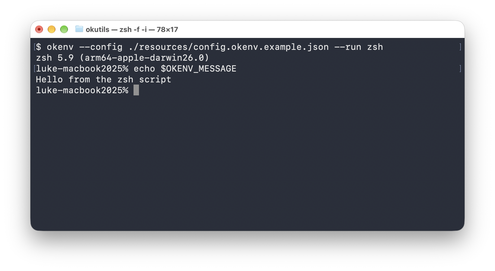

# README.md

> [!NOTE]
> 在 GitHub 上阅读时，可点击右上角的目录按钮跳转到所需章节。

okenv 是一个零依赖的环境配置与脚本执行工具。用一份 JSON 文件配置命令、环境变量和平台差异，再按脚本名称运行。

主要功能：

- 设置环境变量
- 像 `npm run` 一样按名称运行脚本
- 按顺序执行多条命令
- 按系统和架构配置不同的命令与环境变量
- 预览执行计划（Dry Run）

<div align="center" style="width: 80%; margin: 0 auto;">
  
</div>

okenv 只提供 CLI，配置使用标准 JSON。默认直接运行指定程序；需要管道、重定向等 Shell 功能时，请显式调用 Shell。

## 安装

### 支持的平台

okenv 支持在以下平台运行。配置中的 `os` 和 `arch` 也使用表中的名称，具体用法见[跨平台配置](#跨平台配置)。

| 系统    | `os`      | `arch`           |
| ------- | --------- | ---------------- |
| Windows | `windows` | `arm64`、`amd64` |
| Linux   | `linux`   | `arm64`、`amd64` |
| macOS   | `darwin`  | `arm64`          |

### 安装

安装 Go 工具链（`>=1.25`）之后运行：

```bash
go install github.com/okutils/okenv/cmd/okenv@latest
```

请将 Go 的可执行文件安装目录加入 `PATH`：设置了 `GOBIN` 时使用该目录，否则通常为 `GOPATH` 下的 `bin` 目录。

也可以将 `@latest` 替换为具体版本号，或使用 `@main` 安装主分支版本。

### 验证安装

```bash
okenv --version
okenv --help
```

## 快速开始

以下示例需要 Node.js，也可以换成其他程序。okenv 本身不依赖 Node.js。

### 创建 config.okenv.json

在项目目录创建 `config.okenv.json`，使用标准 JSON 格式：

```json
{
  "env": {
    "NODE_ENV": { "value": "development" }
  },
  "scripts": {
    "default": {
      "description": "查看 Node.js 版本",
      "command": "node",
      "args": ["--version"]
    }
  }
}
```

### 运行第一个脚本

在配置文件所在目录执行：

```bash
okenv --run default
```

okenv 会启动 `node --version`，并为该进程设置 `NODE_ENV=development`。环境变量只传给子进程，不会修改当前终端的环境。

### 设置默认脚本

名为 `default` 的脚本就是默认入口。上面的配置也可以直接运行：

```bash
okenv
```

没有 `default` 时，直接运行会报错。要运行其他脚本，使用 `okenv --run <name>`。

### 列出脚本与预览执行计划

```bash
okenv --list
okenv --dry-run
okenv --verbose
```

`--list` 列出脚本；`--dry-run` 只展示执行计划；`--verbose` 展示执行信息并实际运行。

仓库还提供了[交互式 Shell 示例](./resources/config.okenv.example.json)，可在仓库根目录运行：

```bash
okenv --config resources/config.okenv.example.json
```

默认分支需要 Bash，Windows 分支使用 `cmd.exe`。进入会话后输入 `exit` 退出。

仓库本身也使用 okenv 管理构建和格式化脚本，可参考根目录的 [config.okenv.json](./config.okenv.json) 和[开发](#开发)一节。

## 编写脚本

### 程序与参数：command 和 args

`command` 填写一个程序名或路径，`args` 中每一项都是一个独立参数：

```json
{
  "scripts": {
    "dev": {
      "description": "启动开发服务",
      "command": "node",
      "args": ["./src/main.js", "--title", "hello world"]
    }
  }
}
```

这里的 `hello world` 会作为一个参数传入，不会按空格拆开。

不要将整条命令写成 `"command": "node ./src/main.js"`。需要管道、重定向、通配符或 `&&` 时，见[使用 Shell 语法](#使用-shell-语法)。

用 `--run <name>` 选择脚本，子进程参数写在配置的 `args` 中。okenv 不支持在 `--` 后追加子进程参数。完整限制见[CLI 选项与组合规则](#cli-选项与组合规则)。

### 脚本名称与 description

脚本名区分大小写。可以使用中文、空格或 `build:linux:amd64` 这样的名称。

`description` 是可选的脚本说明，会显示在 `--list` 的结果中。

### 工作目录：cwd

脚本默认在配置文件所在目录执行。相对 `cwd` 也以配置文件所在目录为基准：

```json
{
  "scripts": {
    "dev": {
      "command": "node",
      "args": ["main.js"],
      "cwd": "./app"
    }
  }
}
```

| `cwd` 写法            | 工作目录                |
| --------------------- | ----------------------- |
| 省略或 `null`         | 配置文件所在目录        |
| `"."`                 | 配置文件所在目录        |
| `"./app"`             | 配置目录下的 `app`      |
| 绝对路径              | 指定目录                |
| `""` 或变量展开后为空 | 调用 okenv 时的当前目录 |

okenv 不自动创建目录。`args` 中的路径由目标程序解释，不会被 okenv 改写。

> [!NOTE]
>
> Windows 下，过长的工作目录可能导致程序启动失败，即使配置能正常读取、`--dry-run` 也能正常预览。遇到这种情况，请尝试缩短目录路径。
>
> 在 Windows 11 25H2 + Go 1.27.1 的测试中，启用系统长路径支持后仍出现此问题；直接调用 Go 的 `os/exec` 也能复现，目前尚未解决。

### 串行执行多条命令

可以将多条命令放入 `commands`，按数组顺序串行执行：

```json
{
  "scripts": {
    "check": {
      "description": "检查并构建项目",
      "cwd": ".",
      "commands": [
        { "command": "go", "args": ["test", "./..."] },
        { "command": "go", "args": ["build", "./..."] }
      ]
    }
  }
}
```

默认遇到失败就停止。

同一分支只能选择 `command` 或 `commands`。命令组外层的 `cwd` 和 `env` 对所有条目生效，每个条目只支持 `command`、`args`、`ignoreError`。

每条命令在独立进程中运行，执行过程中对环境变量或工作目录的修改不会传到下一条。需要共享 Shell 状态时，将相关操作放在同一次 Shell 调用或同一个脚本文件中。

### 复用已有脚本

如果已经定义了 `lint` 和 `test`，可以在 `commands` 中调用 `okenv --run` 来复用它们：

```json
{
  "scripts": {
    "check": {
      "commands": [
        { "command": "okenv", "args": ["--run", "lint"] },
        { "command": "okenv", "args": ["--run", "test"] }
      ]
    }
  }
}
```

运行 `okenv --run check`，就会依次运行 `lint` 和 `test`，不用再写一遍它们的命令。

### 失败后继续

在单命令脚本或命令组条目上设置 `"ignoreError": true`，可以在程序返回非零退出码后继续执行：

```json
{
  "scripts": {
    "check": {
      "commands": [
        {
          "command": "go",
          "args": ["vet", "./..."],
          "ignoreError": true
        },
        { "command": "go", "args": ["test", "./..."] }
      ]
    }
  }
}
```

失败被忽略时会输出提示，再继续下一条。没有其他失败时，okenv 最终返回 `0`。

`ignoreError` 只处理程序启动后返回的非零退出码。配置或启动错误仍会停止执行；子进程被信号终止、Go 未返回退出码时，也会停止。

命令组需要逐条设置 `ignoreError`。写在外层会报错，即使值为 `false`。

> [!NOTE]
>
> Windows 上，取消任务也可能被 `ignoreError: true` 忽略，详见[标准输入输出与中断行为](#标准输入输出与中断行为)。

### 使用 Shell 语法

需要管道、重定向或 `&&` 等 Shell 语法时，将 Shell 填入 `command`，把命令字符串放入 `args`。例如，在安装了 Bash 的系统上：

```json
{
  "scripts": {
    "check": {
      "command": "bash",
      "args": ["-c", "go vet ./... && go test ./..."]
    }
  }
}
```

Windows 上可以将 `command` 设为 `cmd.exe`，例如搭配 `"args": ["/d", "/c", "ver"]`。okenv 不会自动为 `.cmd`、`.bat` 或 `.ps1` 添加解释器；运行这类脚本时，请显式调用 `cmd.exe` 或 PowerShell。

Shell 收到参数前，okenv 仍会先展开其中的 `$NAME` 和 `${NAME}`。复杂 Shell 内容建议写入脚本文件，再用 `bash ./foo/bar.sh` 等方式调用，避免两层变量展开相互影响。

### 空脚本与空命令组

没有覆盖项时，`{}` 是一个合法的空脚本；`"commands": []` 表示明确的空执行分支。两者都不执行命令，没有其他错误时返回 `0`。

`"command": ""` 则表示程序名为空，运行和预览都会失败。`"commands": [{}]` 也不是空命令组，它包含一条缺少程序名的命令。

## 配置环境变量

### 全局变量与脚本级变量

顶层 `env` 对所有脚本生效，脚本分支中的 `env` 只对该分支生效。每个变量都使用对象定义，值必须是字符串：

```json
{
  "env": {
    "NODE_ENV": { "value": "development" },
    "PORT": { "value": "3000" }
  },
  "scripts": {
    "test": {
      "command": "node",
      "args": ["--test"],
      "env": {
        "NODE_ENV": { "value": "test" }
      }
    }
  }
}
```

不支持 `"PORT": "3000"` 或 `"value": 3000` 这样的简写。变量名不能为空，也不能包含 `=`。

### 环境变量的优先级

同名环境变量按以下优先级取值，各层先根据当前平台选择适用的值：

```text
脚本级变量 > 全局变量 > 父进程环境变量
```

上例的 `test` 进程收到 `NODE_ENV=test` 和 `PORT=3000`，其他变量继续继承。

Windows 上，`PATH` 和 `Path` 会被视为同名变量。同一层按变量名区分大小写的字典序注入，排序靠后的项覆盖靠前的项；建议避免在同一层定义这类大小写变体。

### 引用父进程环境变量

> [!NOTE]
> `$NAME` 和 `${NAME}` 只读取 okenv 启动时继承的环境变量。JSON 中定义的变量不能相互引用，书写顺序也不影响展开结果。变量名、脚本名和 `description` 不参与展开。

环境变量值、`command`、每项 `args` 和 `cwd` 支持 `$NAME`、`${NAME}`：

```json
{
  "env": {
    "NODE_ENV": { "value": "${APP_MODE}" }
  },
  "scripts": {
    "dev": {
      "command": "node",
      "args": ["./src/main.js", "--port", "${APP_PORT}"]
    }
  }
}
```

运行前需要在调用环境中设置 `APP_MODE` 和 `APP_PORT`。

### 空值、缺失变量与展开规则

- `"value": ""` 会设置空字符串，不表示删除变量。
- 引用不存在的父环境变量时，结果为空字符串。
- 每个字符串只展开一次；替换结果中的 `$NAME` 不会再次展开。
- 参数展开后仍是一个参数，即使包含空格或变为空字符串。
- 不提供 `${NAME:-default}` 这样的默认值语法，也没有额外的美元符号转义语法。

仅写 `{}` 或 `null` 不能定义一个环境变量。每个变量必须有默认 `value`，或至少一个提供值的平台覆盖项。

### 运行前检查环境变量

用 `options.checkEnv` 检查程序需要的环境变量，避免缺少配置或填写错误时仍启动程序。顶层规则对所有脚本生效，脚本中的规则只对当前执行分支生效；两处规则都要满足。

例如，启动 Node.js 服务前，检查运行模式和端口：

```json
{
  "options": {
    "checkEnv": {
      "APP_MODE": {
        "required": true,
        "enum": ["development", "production"]
      }
    }
  },
  "scripts": {
    "serve": {
      "command": "node",
      "args": ["server.js"],
      "env": {
        "APP_MODE": { "value": "development" },
        "PORT": { "value": "3000" }
      },
      "options": {
        "checkEnv": {
          "PORT": { "required": true, "pattern": "[0-9]+" }
        }
      }
    }
  }
}
```

准备好自己的 `server.js` 后运行：

```bash
okenv --run serve
```

检查通过后才启动服务。例如，将 `PORT` 改为 `"abc"` 会检查失败，服务不会启动。这里的正则只检查是否全是数字，不保证端口范围合法。

| 规则 | 用法 |
| ---- | ---- |
| `required` | 设为 `true` 时，变量必须存在且不能是空字符串 |
| `enum` | 值必须与数组中的某个字符串完全相同，区分大小写 |
| `pattern` | 整个值必须符合 Go `regexp` 正则表达式，例如 `[0-9]+` 接受 `3000`，不接受 `abc3000` |

同一个变量配置多种规则时，必须全部满足。未设置 `required: true` 的变量可以不存在，此时跳过枚举和正则检查；如果存在但为空字符串，仍会检查。

规则检查的是最终传给子进程的值。也可以只检查从终端或 CI 继承的变量，不必在 `env` 中重新赋值。

只想检查环境、不运行程序时，可以定义一个空命令组：

```json
{
  "scripts": {
    "check": {
      "commands": [],
      "options": {
        "checkEnv": {
          "API_TOKEN": { "required": true }
        }
      }
    }
  }
}
```

运行 `okenv --run check` 即可检查 `API_TOKEN`。规则应写在脚本或命令组外层，不能写在 `commands` 的单条命令中。

运行和 `--dry-run` 都会检查环境值，`--list` 不会。检查失败时返回 `125`，不启动任何命令，也不受 `ignoreError` 影响。错误会指出规则位置和原因，不显示变量实际值；预览和 verbose 的显示范围见[输出通道与敏感信息](#输出通道与敏感信息)。其他边界情况见[环境变量检查规则](#环境变量检查规则)。

### PATH 与程序查找

`command` 只填写程序名时，okenv 使用**启动时继承的 `PATH`** 查找程序。配置中的 `PATH` 只传给子进程，不参与这次查找；Windows 的 `PATHEXT` 同理。

找不到程序或需要指定版本时，请在启动 okenv 前调整 `PATH`，或在 `command` 中填写明确的程序路径。

程序查找和可执行文件的相对路径处理遵循 Go 标准库的平台规则。okenv 不会自行把 `command` 与 `cwd` 拼成绝对路径；通过 `PATH` 命中当前目录程序也可能被标准库拒绝。需要运行当前目录中的程序时，使用 `./tool` 或 Windows 的 `.\tool.exe` 等显式路径。

## 跨平台配置

### 平台名称与匹配规则

环境变量和脚本都通过 `overrides` 设置平台分支。每项必须提供 `os` 和非空 `arch` 数组，名称见[支持的平台](#支持的平台)。

```json
{ "os": "windows", "arch": ["arm64", "amd64"] }
```

不接受 `macos`、`x64` 等别名。同一个覆盖列表内，平台组合不能重复或重叠；匹配不依赖条目顺序。

平台取自 **okenv 二进制的目标系统与架构**，可用 `--version` 查看。在 ARM64 主机上运行 AMD64 二进制时，选择的是 AMD64 分支。设置环境变量 `GOOS`、`GOARCH` 不会改变这个判断。

### 为环境变量设置平台值

```json
{
  "env": {
    "APP_PLATFORM": {
      "value": "unix",
      "overrides": [
        {
          "os": "windows",
          "arch": ["arm64", "amd64"],
          "value": "windows"
        }
      ]
    }
  },
  "scripts": {
    "default": {
      "command": "node",
      "args": ["--version"]
    }
  }
}
```

每个变量覆盖项都必须提供自己的 `value`，允许空字符串。

### 为脚本设置平台执行分支

```json
{
  "scripts": {
    "default": {
      "description": "显示系统信息",
      "command": "uname",
      "args": ["-s"],
      "overrides": [
        {
          "os": "windows",
          "arch": ["arm64", "amd64"],
          "command": "cmd.exe",
          "args": ["/d", "/c", "ver"]
        }
      ]
    }
  }
}
```

覆盖项也可以使用 `commands`，替换整个命令组。

### 整体替换与字段默认值

**脚本命中覆盖项后，使用该项完整的执行配置，不与默认分支合并。**

| 覆盖项中省略的字段      | 行为                                |
| ----------------------- | ----------------------------------- |
| `command` 和 `commands` | 执行零条命令                        |
| `args`                  | 不传参数                            |
| `cwd`                   | 使用配置文件所在目录                |
| `env`                   | 不注入脚本级变量，顶层 `env` 仍生效 |
| `ignoreError`          | 使用 `false`                        |
| `options.checkEnv`      | 不检查默认分支规则，顶层规则仍生效 |

覆盖分支需要的参数、工作目录和脚本级变量，都要在覆盖项中填写。所有分支共享的变量可以放在顶层 `env`；`description` 属于脚本本身，不受覆盖项影响。

### 未匹配平台时的行为

| 对象     | 有默认值或默认执行分支 | 没有默认值或默认执行分支       |
| -------- | ---------------------- | ------------------------------ |
| 环境变量 | 使用默认值             | 不注入，保留已有环境值         |
| 脚本     | 使用默认分支           | 运行和预览报错，列表标为不可用 |

只提供平台分支的脚本，默认层不要填写 `cwd`、`env`、`args`、`ignoreError` 或非 null 的 `options.checkEnv`（包括 `{}`）。如需在其他平台成功跳过，可以在默认层明确设置 `"commands": []`。

## 管理配置文件

### 默认配置位置

不传 `--config` 时，只读取当前目录的 `config.okenv.json`。okenv 不向父目录搜索，也不会尝试其他文件名。

### 指定配置

项目有多份配置时，用 `--config` 选择。例如，使用生产环境配置：

```bash
okenv --config config.okenv.production.json --run build
okenv --config config.okenv.production.json --list
```

### 配置路径与相对目录

相对配置路径以调用时的当前目录为基准；配置中的相对 `cwd` 以配置文件所在目录为基准。

例如在 `/workspace` 执行：

```bash
okenv --config ./app/config.okenv.json --run dev
```

省略 `cwd` 时，脚本在 `/workspace/app` 执行；填写 `"cwd": ""` 时，则在 `/workspace` 执行。

配置文件是符号链接时，以链接所在目录为基准。

### JSON 格式与配置校验

配置必须是标准 JSON，不支持注释、尾随逗号、JSONC、YAML 或 `.env`。

运行、列表和预览都会先校验整份配置，包括未选中的脚本和平台分支。其他分支中的字段冲突、无效环境变量、平台重叠或非法正则，也会导致本次操作失败。同一条环境检查规则不能同时设置 `required: true` 和 `enum: []`。

未知字段会被忽略，字段名拼错可能不会报错。建议使用下节的 JSON Schema 获取编辑器提示，再通过预览确认执行内容。

请使用本文中的小写字段名，不重复定义同一个键。重复键、`null` 和字段名匹配按 Go 的 JSON 解码规则处理。

运行和预览还会校验变量展开后的执行计划。每条命令的程序名不能为空；配置注入的环境变量名称和值不能包含 NUL 字符（`\u0000`），即使没有命令也会检查。有命令需要执行时，程序名、参数和工作目录也不能包含 NUL。

命令组会先完成所有条目的校验，再开始执行。任一条不合法，整组都不会启动。`--list` 不检查展开结果。

### 编辑器补全与 JSON Schema 校验

仓库提供 [config.okenv.schema.json](./resources/config.okenv.schema.json)。将它放到项目中，并在配置顶层添加相对路径，例如：

```json
{
  "$schema": "./config.okenv.schema.json",
  "scripts": {
    "default": {
      "command": "node",
      "args": ["--version"]
    }
  }
}
```

支持 JSON Schema 的编辑器可据此提供补全和校验。`$schema` 仅供编辑器使用，okenv 不会读取或下载它。平台覆盖重叠、变量展开后的程序名等问题仍由 okenv 校验；程序和目录是否存在等条件则在启动时检查。

## 查看与调试

### 列出可以运行的脚本

```bash
okenv --list
```

列表按脚本名排序，展示名称、当前平台是否适用和描述。

列表不展开变量，也不要求存在 `default` 脚本。

### 预览执行计划

```bash
okenv --run dev --dry-run
```

预览展示配置路径、平台、所选分支、工作目录、环境注入项，以及展开后的命令、参数和错误策略。

预览使用与运行相同的计划生成规则，检查配置、展开结果及最终环境约束。程序是否存在、工作目录是否存在、权限是否足够，要到实际启动时才能确认。排查启动问题时，可以用 `--verbose` 查看实际执行内容。

预览中的引号用于表示字符串，整段展示不能直接作为 Shell 命令复制执行。

### 查看实际执行过程

```bash
okenv --run dev --verbose
```

先展示配置路径、平台等公共信息，再逐条展示即将执行的命令。执行中途停止时，后续命令不会出现在输出中。

普通运行不额外打印命令或成功提示，子进程输出直接显示。`--verbose` 固定使用文本，不能与 `--dry-run` 或 `--list` 同时启用。

### JSON 输出与自动化集成

```bash
okenv --list --format json
okenv --run dev --dry-run --format json
```

在支持重定向的 Shell 中，可以保存预览：

```bash
okenv --run dev --dry-run --format json > plan.json
```

字段结构见[JSON 输出结构](#json-输出结构)。输出对象用于查看与集成，不是可直接作为配置重新加载的格式。

### 输出通道与敏感信息

列表、预览、帮助和版本正文写入 `stdout`；错误、警告及 verbose 展示写入 `stderr`。子进程直接继承标准输入输出，verbose 不会向子进程的 `stdout` 添加内容。

**预览和 verbose 会展示实际值，不会脱敏。** 分享输出或保存到 CI 日志前，请检查是否包含令牌、密码等信息。

预览中的 `env` 只包含配置注入项，不是完整子进程环境。它先列出全局变量，再列出脚本级变量，保留跨层的同名项；每层内部按变量名区分大小写的字典序排列。

## 参考

### CLI 选项与组合规则

| 选项                    | 别名 | 默认值              | 用途                 |
| ----------------------- | ---- | ------------------- | -------------------- |
| `--run <name>`          |      | `default`           | 选择脚本运行         |
| `--config <path>`       |      | `config.okenv.json` | 指定配置文件         |
| `--list`                | `-l` | `false`             | 列出脚本             |
| `--dry-run`             |      | `false`             | 预览执行计划         |
| `--verbose`             |      | `false`             | 展示信息并实际执行   |
| `--format <text\|json>` |      | `text`              | 列表或预览的输出格式 |
| `--help`                | `-h` | `false`             | 显示帮助             |
| `--version`             |      | `false`             | 显示版本             |

`--config` 可搭配运行、列表或预览。`--run` 可搭配 `--dry-run` 或 `--verbose`，后两者不能同时启用。`--list` 与 `--run`、`--dry-run`、`--verbose` 互斥。帮助和版本分别独立使用。

只有列表和预览允许 `--format`；实际运行时即使显式传入 `--format text` 也会报错。

同一选项重复设置时，以最后一次成功解析的值为准。例如：

```bash
# 运行 test，而不是 build
okenv --run build --run test

# 最终 list 为 false，因此可以运行 build
okenv --list --list=false --run build
```

以下写法不受支持：

```bash
okenv -lh                 # 不能合并短选项；请分别使用 -l 或 -h
okenv build               # 不能用位置参数选择脚本；请使用 --run build
okenv NODE_ENV=test       # 不能直接赋值环境变量；请在配置的 env 中设置
okenv --run build -- --watch  # 不能追加程序参数；请在配置的 args 中设置
```

`--config` 接受配置文件路径，不要求特定扩展名。路径中的环境变量不会由 okenv 展开；`-` 不能用来从标准输入读取配置。

### 配置字段速查

#### 顶层字段

| 字段      | 类型 | 说明                     |
| --------- | ---- | ------------------------ |
| `env`     | 对象 | 所有脚本共享的环境变量   |
| `scripts` | 对象 | 脚本名称到脚本定义的映射 |
| `options.checkEnv` | 对象 | 所有脚本共享的环境变量检查规则 |

#### 脚本与执行分支

脚本的默认执行配置和 `overrides` 中的平台执行配置使用相同的执行字段：

| 字段           | 类型         | 默认行为或约束                                   |
| -------------- | ------------ | ------------------------------------------------ |
| `description`  | 字符串       | 仅属于脚本；默认空说明                           |
| `command`      | 字符串       | 单个程序名或路径；与 `commands` 互斥             |
| `args`         | 字符串数组   | 单命令参数；默认不传参数                         |
| `commands`     | 命令对象数组 | 串行命令组；允许空数组                           |
| `cwd`          | 字符串       | 省略或 `null` 使用配置目录；空字符串使用调用目录 |
| `env`          | 对象         | 当前分支的环境变量；默认无注入项                 |
| `ignoreError` | 布尔值       | 单命令失败策略；默认 `false`                     |
| `options.checkEnv` | 对象 | 当前执行分支的环境变量检查规则 |
| `overrides`    | 平台分支数组 | 仅属于脚本；默认无覆盖                           |

命令组条目只定义 `command`、`args` 和 `ignoreError`。外层不能填写 `args` 或 `ignoreError`，包括空数组和 `false`。未设置 `command` 时，这两个字段也只能省略或设为 `null`。

空脚本和空默认分支的区别见[空脚本与空命令组](#空脚本与空命令组)及[未匹配平台时的行为](#未匹配平台时的行为)。

#### 环境变量与平台条件

| 位置           | 字段        | 类型与要求                     |
| -------------- | ----------- | ------------------------------ |
| 环境变量定义   | `value`     | 默认字符串值；空字符串有效     |
| 环境变量定义   | `overrides` | 变量平台覆盖数组               |
| 变量覆盖项     | `value`     | 必须提供字符串值，不继承默认值 |
| 任意平台覆盖项 | `os`        | 支持的系统名称                 |
| 任意平台覆盖项 | `arch`      | 非空架构字符串数组             |

每个环境变量至少有一个值来源。每个覆盖列表内的平台组合必须唯一。

#### 环境变量检查规则

`options.checkEnv` 中每个变量对应一个规则对象，常用写法见[运行前检查环境变量](#运行前检查环境变量)。

| 配置或值 | 行为 |
| -------- | ---- |
| `required: false` 或省略 | 变量可以不存在 |
| 值只包含空白字符 | 可以通过必填检查，不会自动去除空白 |
| `enum` 省略或为 `null` | 不限制允许值 |
| `enum: []` | 变量只要存在就不通过；不能与 `required: true` 同时使用 |
| `enum` 中有重复值 | 允许，不影响检查 |
| `pattern` 省略或为 `null` | 不检查正则 |
| `pattern: ""` | 只接受空字符串；变量不存在且非必填时跳过 |
| 规则为 `{}` 或 `null` | 不增加任何约束 |

枚举和正则不展开环境变量，也不去除空白。正则中的换行匹配和 `(?s)`、`(?m)` 等模式标记遵循 Go 标准库，始终要求匹配整个值。

检查名称没有额外的格式限制，按目标系统的环境变量名称规则查找；Windows 上名称不区分大小写。最终环境包含工作目录对 `PWD` 的影响；显式配置 `PWD` 时使用配置值。

空脚本和空命令组也会检查环境。检查在执行计划校验通过后进行，遇到首个失败就停止。必填错误中的 `missing` 表示变量不存在，`empty` 表示值为空字符串。

#### 省略、空值与 `null`

省略字段、`null` 和空字符串有不同含义（以下以字段没有重复定义为前提）：

- `command`、`cwd`、`value`：`null` 等同于未提供；`""` 表示明确提供空字符串，具体行为见对应字段说明。
- `commands`：`null` 表示未提供执行分支；`[]` 表示提供一个不执行任何命令的分支。

空配置的 `--list` 结果为空，直接运行则会因缺少 `default` 报错。将某个脚本定义为 `{}` 或 `null`，会得到空脚本。

`args` 数组中的 `null` 会被解析为空字符串参数。需要传入空参数时，建议直接写 `""`。

### JSON 输出结构

列表输出示例：

```json
{
  "scripts": [
    {
      "name": "default",
      "description": "查看 Node.js 版本",
      "available": true
    }
  ]
}
```

执行预览示例，路径和平台按实际运行环境变化：

```json
{
  "context": {
    "config": "/workspace/config.okenv.json",
    "os": "linux",
    "arch": "amd64",
    "branch": "default"
  },
  "script": "default",
  "cwd": "/workspace",
  "env": ["NODE_ENV=development"],
  "commands": [
    {
      "command": "node",
      "args": ["--version"],
      "ignoreError": false
    }
  ]
}
```

`context.config` 是配置入口的绝对路径，`branch` 为 `default` 或 `override`。`cwd` 为空字符串时表示使用调用目录；`command` 是展开后的配置值，不是查找后得到的程序路径。

单命令也放在 `commands` 数组中。空集合输出 `[]`，空字符串和 `false` 会保留。供机器读取时，请使用 JSON 字段，不要解析文本展示或错误消息。

### 退出码

| 情况                                                       | 退出码               |
| ---------------------------------------------------------- | -------------------- |
| 成功，或所有失败都已被忽略                                 | `0`                  |
| 子进程非零退出，且未忽略                                   | 原样传递子进程退出码 |
| 子进程被信号终止，没有返回退出码，且 okenv 仍在运行        | `1`                  |
| 参数、配置、计划校验、脚本不存在、平台不适用或普通输出错误 | `125`                |
| 程序查找或启动失败，且不属于下述未找到错误                 | `126`                |
| 程序查找或启动错误被 Go 标准库识别为 `exec.ErrNotFound`    | `127`                |

例如，裸程序名未找到通常返回 `127`，显式路径启动失败可能返回 `126`。子进程也可以自行返回 `125`、`126` 或 `127`，因此需要结合错误信息判断来源。

### 标准输入输出与中断行为

子进程直接继承标准输入输出，可用于交互程序、管道和重定向。串行命令共用同一个输入来源，前一条读过的内容不会为后一条重放。

Ctrl+C 和外部信号由 Go 与操作系统按默认方式处理，具体结果取决于平台和终端，中断退出码不一定是 `130`。okenv 没有额外的信号转发、进程组管理或后代进程清理逻辑，退出后仍可能有子进程或后代进程在运行。需要确保整个任务停止时，请由调用方管理进程的终止和清理。

Windows 上，Ctrl+C 可能产生 `0xC000013A`（某些终端显示为 `-1073741510`），okenv 不会将它统一转换为 `130`。当只有子进程终止、okenv 仍在运行时，若 Go 将其报告为非零退出码，仍按 `ignoreError` 处理：设为 `true` 就会继续执行下一条命令。

交互式 `cmd.exe` 会话请使用 `exit` 正常退出。Ctrl+C 可能只结束 okenv，留下仍在运行的 cmd 会话。

okenv 自身的列表、预览等输出写入失败时会停止操作，但已执行的命令不会回滚。向已关闭的输出管道写入还可能触发 SIGPIPE，进程会按默认信号行为退出，退出码可能不同于普通输出错误的 `125`。

## 开发

在 okenv 仓库根目录执行以下命令。项目使用自己的 [config.okenv.json](./config.okenv.json) 管理构建和格式化脚本。

### 本地构建

安装 Go 后执行：

```bash
go build -o dist/local/ ./cmd/okenv
```

已安装 okenv 时，也可以运行：

```bash
okenv --run build
```

产物位于 `dist/local`。

### 跨平台构建

```bash
okenv --run build:linux:amd64
```

将脚本名中的系统与架构替换为[支持的平台](#支持的平台)组合即可，产物位于 `dist/<os>/<arch>`。

### 代码格式化

安装 `golangci-lint` 后执行：

```bash
okenv --run format
```

## 许可证

[MIT](./LICENSE)。
